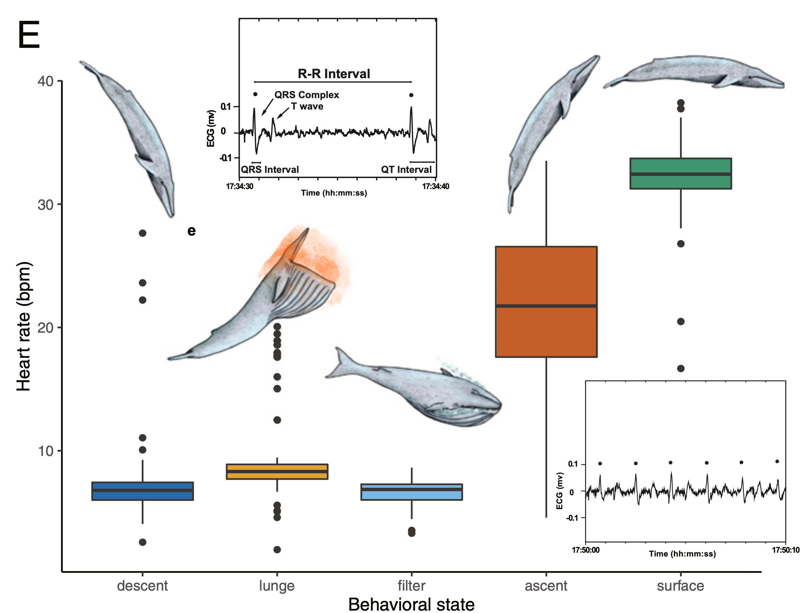
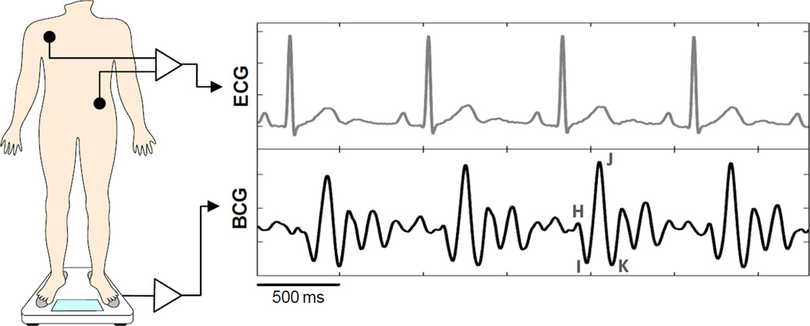
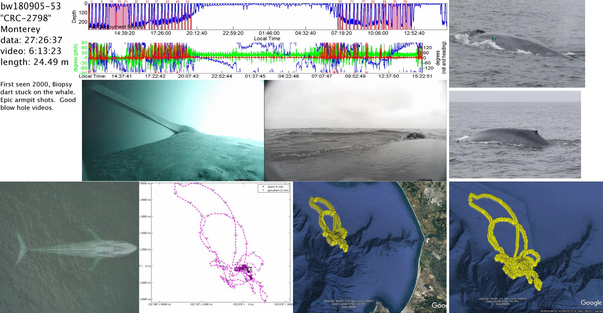

```{r setup, include=FALSE}
library(lubridate)
library(patchwork)
library(plotly)
library(tidyverse)
knitr::opts_chunk$set(echo = FALSE)
source("read_nc.R")
theme_set(theme_minimal() +
            theme(axis.title.x = element_blank()))
```

```{r load, include=FALSE, cache=TRUE}
bw180905_53 <- read_nc("bw180905-53_prh10_ballisto.nc")
```

## Diving Cardiovascular Physiology

- Dive response: submerged bradycardia and surface tachycardia 
- Allometry predicts 15 bpm for blue whale
- Observed ~8 bpm submerged bradycardia, ~25 bpm surface tachycardia
- Duration of heart beat ~1.8 s

{width=50%,height=50%}

## Ballistocardiogram

- Cardiovascular function via ballistic forces
- As blood pumps into great vessels, body mass recoils
- Greatest magnitude in longitudinal direction

{width=75%,height=75%}

## bw180905-53

- Slipped behind pectoral flipper
- Overnight deployment

{width=75%,height=75%}

## bw180905-53 heart beats

- Cadence (~6 bpm) and duration (~1.8 s) match ECG
- Only detectable at night during rest dives
- No surface tachycardia

```{r heartbeats}
dive <- bw180905_53 %>% 
  filter(dt >= "2018-09-06 01:38", 
         dt <= "2018-09-06 01:48")
zoom_start <- ymd_hms("2018-09-06 01:40:25", tz = attr(bw180905_53, "tz"))
zoom_end <- ymd_hms("2018-09-06 01:41:00", tz = attr(bw180905_53, "tz"))
zoom <- dive %>% 
  filter(dt >= zoom_start, 
         dt <= zoom_end)
jerk_peaks <- pracma::findpeaks(zoom$jerk, minpeakheight = 0.07)
beats <- slice(zoom, jerk_peaks[,2])
inter_labels <- tibble(
  dt = beats$dt[1:2] + (beats$dt[2:3] - beats$dt[1:2]) / 2,
  jerk = beats$jerk[1:2] + (beats$jerk[2:3] - beats$jerk[1:2]) / 2 - 0.01,
  bpm = 60 / as.numeric(beats$dt[2:3] - beats$dt[1:2], unit = "secs"),
  label = sprintf("%.1f bpm", bpm)
)
depth_p <- ggplot(dive, aes(dt, p)) +
  geom_line(size = 0.2, color = "dark blue") +
  annotate('rect', 
           xmin = zoom_start, xmax = zoom_end,
           ymin = 17, ymax = 13,
           fill = "dark blue", alpha = 0.25) +
  scale_x_datetime(date_labels = "%H:%M") +
  scale_y_reverse("Depth (m)")
jerk_p <- ggplot(dive, aes(dt, jerk)) +
  geom_line(size = 0.2, color = "magenta") +
  annotate('rect', 
           xmin = zoom_start, xmax = zoom_end,
           ymin = -0.05, ymax = 0.1,
           fill = "magenta", alpha = 0.25) +
  scale_x_datetime(date_labels = "%H:%M") +
  labs(y = "Jerk (m/s^3)")
beats_p <- ggplot(zoom, aes(dt, jerk)) +
  geom_line(size = 0.2, color = "magenta") +
  geom_line(data = beats, color = "grey70") +
  geom_point(data = beats, shape = 21, color = "black", fill = "magenta") +
  geom_text(aes(label = label), inter_labels) +
  annotate('segment', 
           x = beats$dt - 1.4, xend = beats$dt + 0.4, 
           y = 0.03, yend = 0.03) +
  annotate('text', 
           x = beats$dt[1] - 1.7, y = 0.03, 
           label = "1.8 s", hjust = 1) +
  scale_x_datetime(date_labels = "%H:%M:%S") +
  labs(y = "Jerk (m/s^3)")
depth_p / jerk_p / beats_p
```

## Next steps

- Other detection methods? Longitudinal acceleration, acoustics...
- Other deployments? Overnight, behind flipper.
- Just a note? Multi-species comparative study?

## Interactive

```{r interactive}
p_depth <- (ggplot(bw180905_53, aes(dt, p)) +
              geom_line(size = 0.2, color = "dark blue") +
              scale_y_reverse("Depth (m)") +
              theme_classic()) %>% 
  ggplotly(dynamicTicks = TRUE)
p_jerk <- (ggplot(bw180905_53, aes(dt, jerk)) +
             geom_line(size = 0.2, color = "magenta") +
             labs(y = "Jerk (m/s^3)") +
             theme_classic()) %>% 
  ggplotly(dynamicTicks = TRUE)

subplot(p_depth, p_jerk,
        nrows = 2, 
        shareX = TRUE, 
        titleX = FALSE,
        titleY = TRUE)
```

## Resources

**Presentation:** https://flukeandfeather.github.io/ballistocardiogram/ballistocardiogram.html

**Repository:** https://github.com/FlukeAndFeather/ballistocardiogram

Giovangrandi, Laurent, Omer T Inan, Richard M Wiard, Mozziyar Etemadi, and Gregory TA Kovacs. “Ballistocardiography—a Method Worth Revisiting.” In *2011 Annual International Conference of the IEEE Engineering in Medicine and Biology Society*, 4279–82, 2011. https://dx.doi.org/10.1109%2FIEMBS.2011.6091062.

Goldbogen, Jeremy A., D. E. Cade, J. Calambokidis, M. F. Czapanskiy, J. Fahlbusch, A. S. Friedlaender, W. T. Gough, et al. “Extreme Bradycardia and Tachycardia in the World’s Largest Animal.” *Proceedings of the National Academy of Sciences* 116, no. 50 (December 10, 2019): 25329–32. https://doi.org/10.1073/pnas.1914273116.
